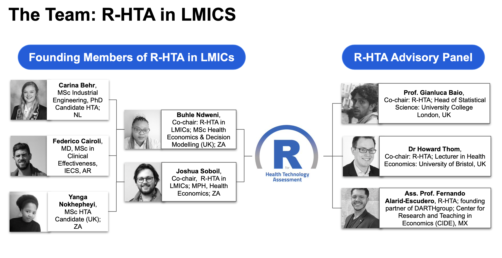

# R-HTA

[R-HTA](https://r-hta.org/) is a consortium focused on popularising the use of R for health economics and health technology assessment (HTA). The main body of R-HTA includes members primarily from the Americas and UK, who have diverse experience in government (including [NICE](https://www.nice.org.uk/) in the UK), academia, and industry. The aims of R-HTA, in general, are to:
- Provide discussion on the many R [packages](https://r-hta.org/#resources) available to HTA analysts;
- Assist users to get the most out of R for cost-effectiveness analysis; and
- Host [presentations](https://r-hta.org/#talk) and [public discussions](https://www.youtube.com/channel/UCUog4U8cjXuQIvINSDsiEJQ) to facilitate the development of R for HTA

**‘R-HTA in LMICs’ is the LMIC-focused chapter of this consortium that aims to introduce and showcase the strengths of R specifically to LMIC analysts and health care institutions**

## Why an LMIC chapter?
Microsoft Excel and TreeAge remain popular software for HTA modelling, especially in LMICs.
- Many standard software used for HTA and health economics require costly subscriptions
- R is a [free](https://www.r-project.org/), open source software - an obvious benefit in LMICs

Because LMICs are moving towards the principles of Universal Health Coverage (UHC) there will be an increased demand for complex HTA methodology, especially in oncology and other rare diseases.
- This will make the need for more efficient and comprehensive software for HTA within LMICs gradually more necessary

Most LMIC institutions do not offer in-depth HTA tutorials in R.
- There is a need to provide accessible workshops that showcase the strengths of R while also providing online tutorial and coding resources for LMIC analysts

# R-HTA in LMICs
The **aim** of the LMIC chapter is therefore to bridge the gap in the use of R software among HTA analysts in LMICs. We host both presentation-focused and tutorial-focused R workshops. In the first quarter of every year, we host a presentation-based workshop which encourages LMIC Masters and PhD students at universities and members of other partnership organisations to present their R related health economics work. In every subsequent quarter, we host introductory, intermediate and advanced workshops, applied within an LMIC context, which focus on practical, in-depth topics associated with modelling in R. For example: in introductory workshops, we teach participants the basics of R and discuss how to use several open-source HTA R packages; more advanced topics include developing R-HTA models in interactive formats, using Shiny (click [here](https://shiny.rstudio.com/) for details). All attendees are provided with the key resources and code used in every workshop.

## But why R?
***R scales efficiently***
- This is especially true when an HTA model becomes increasingly complex compared to other commonly used software (read more [here](https://www.valueinhealthjournal.com/action/showPdf?pii=S1098-3015%2819%2930050-6))

***R has an established user-base***
- There are several health economics packages which make coding in R more user-friendly: [BCEA](https://cran.r-project.org/web/packages/BCEA/index.html), [hesim](https://github.com/hesim-dev/hesim), [heemod](https://cran.r-project.org/web/packages/heemod/index.html), and [dampack](https://github.com/feralaes/dampack)
 
***R ensures reproducibility***
- Models can easily and safely be hosted and shared via services such as [Github](https://github.com/)
- Using [‘version control’](https://en.wikipedia.org/wiki/Version_control), updates do not ‘break’ models
- With [RMarkdown](https://rmarkdown.rstudio.com/) and [Shiny](https://shiny.rstudio.com/), analysts can deliver transparent, reproducible reports and interactive models

# The Team

